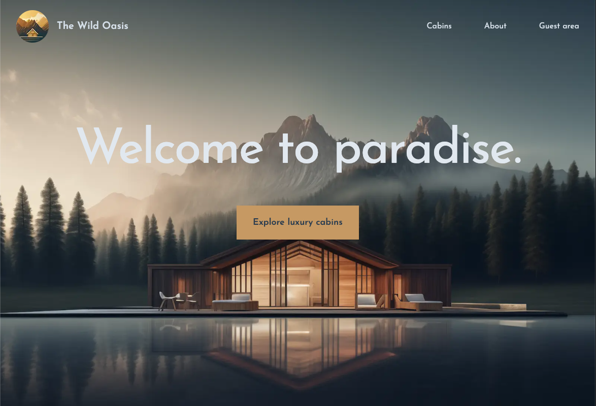

# Wild Oasis Website



## Overview

A comprehensive customer-facing hotel booking website built with **Next.js** that allows guests to learn about "The Wild Oasis" boutique hotel, browse and filter luxurious wooden cabins, make reservations, and manage their profiles.

🏨 **Key Features:**

- **Hotel Information:** Detailed presentation of the hotel and its amenities
- **Cabin Browsing:** Filter and view all available cabins with detailed information
- **Booking System:** Complete reservation process for guests
- **User Profiles:** Create and update guest profiles
- **Responsive Design:** Optimized experience across all devices
- **Performance Optimized:** Fast loading with Next.js optimizations
- **Connected Backend:** Shares the same database with the staff application

---

## ✨ Features

- **Hotel Experience:**

  - Engaging presentation of the hotel and its unique features
  - Photo galleries showcasing the property and surroundings
  - Detailed information about services and amenities

- **Cabin Exploration:**

  - Comprehensive filtering options for available cabins
  - Detailed cabin information (photos, capacity, amenities, pricing)
  - Availability calendar integration

- **Reservation System:**

  - Intuitive booking flow with date selection
  - Real-time availability checking
  - Booking confirmation and management

- **User Account Management:**

  - Authentication with Google provider via NextAuth.js
  - Simple account creation and authentication
  - Personal profile management
  - Booking history and upcoming stays
  - Preference settings

- **Performance Optimization:**

  - Fast page loading with optimized images
  - Self-hosted fonts with Next.js optimization
  - Partial pre-rendering for hybrid static/dynamic content
  - Efficient caching mechanisms

- **Responsive Design:**
  - Seamless experience across desktop, tablet, and mobile devices
  - Tailored interface for different screen sizes
  - Accessible UI components

---

## 🛠 Built With

- **Next.js** - React framework with SSR capabilities
- **React** - UI component library
- **NextAuth.js** - Authentication with Google provider
- **Context API** - UI state management
- **TailwindCSS** - Utility-first CSS framework
- **Supabase** - Backend and database (shared with staff application)
- **react-day-picker** - Date selection component
- **date-fns** - Date manipulation utilities

---

## 🧠 Advanced Patterns

This project implements several advanced Next.js and React patterns:

- **Server Components** - Optimized rendering strategy with React Server Components
- **Client Components** - Interactive UI elements with client-side hydration
- **Hybrid Rendering** - Combination of static and dynamic content generation
- **Data Streaming** - Progressive loading with Suspense integration
- **Custom React Hooks** - Reusable stateful logic

---

## 📈 Next.js Features Utilized

- **App Router** - Modern file-based routing system
- **Nested Layouts** - Component hierarchy for consistent UI elements
- **Metadata API** - Dynamic SEO optimization
- **Image Optimization** - Automatic image processing and delivery
- **Font Optimization** - Performance-focused font loading
- **Static and Dynamic Rendering** - Optimized page generation strategies
- **Suspense Integration** - Granular loading states
- **Caching Mechanisms** - Efficient data handling with multiple cache layers

---


## 🚀 Live Demo

🔗 [https://juliengdev-wildoasis.vercel.app/](https://juliengdev-wildoasis.vercel.app/)

---

## 📦 Installation

Get started with these simple steps:

1. **Clone the repository**

   ```bash
   git clone https://github.com/juliengDev/wild-oasis-website.git
   cd wild-oasis-website
   ```

2. **Install dependencies**

   ```bash
   npm install
   ```

3. **Set up environment variables**

   Create a `.env.local` file with your Supabase credentials:

   ```
   NEXT_PUBLIC_SUPABASE_URL=your_supabase_url
   NEXT_PUBLIC_SUPABASE_ANON_KEY=your_supabase_anon_key
   ```

4. **Start development server**

   ```bash
   npm run dev
   ```

5. **Build for production**

   ```bash
   npm run build
   ```

---

## 🤝 Contributing

Contributions are welcome! Please feel free to submit a Pull Request.

1. Fork the Project
2. Create your Feature Branch (`git checkout -b feature/AmazingFeature`)
3. Commit your Changes (`git commit -m 'Add some AmazingFeature'`)
4. Push to the Branch (`git push origin feature/AmazingFeature`)
5. Open a Pull Request

---

## 👨‍💻 Author

- 🌐 **Portfolio** - [Julien Gilbert](https://juliengilbert.com/)
- 🏆 **GitHub** - [@juliengDev](https://github.com/juliengDev)
- 💼 **LinkedIn** - [Julien Gilbert](https://www.linkedin.com/in/julien-gilbert-reactjs/)

---

🎯 _Feel free to reach out if you have any questions or suggestions!_ 🚀
